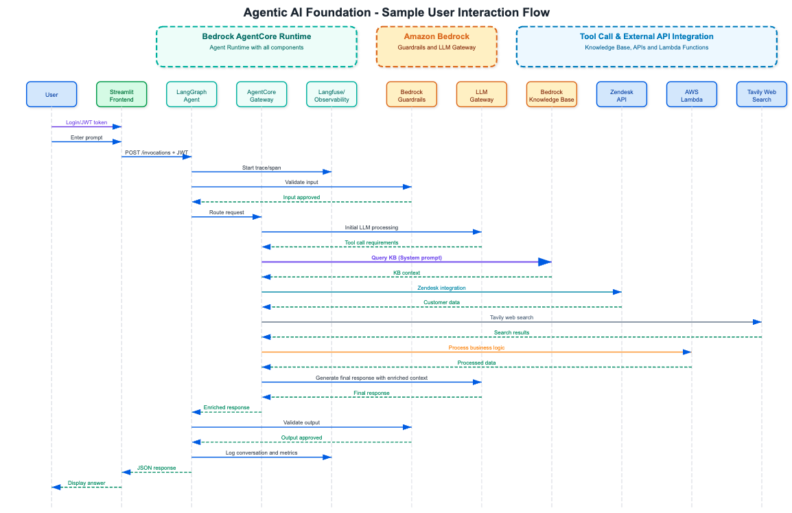
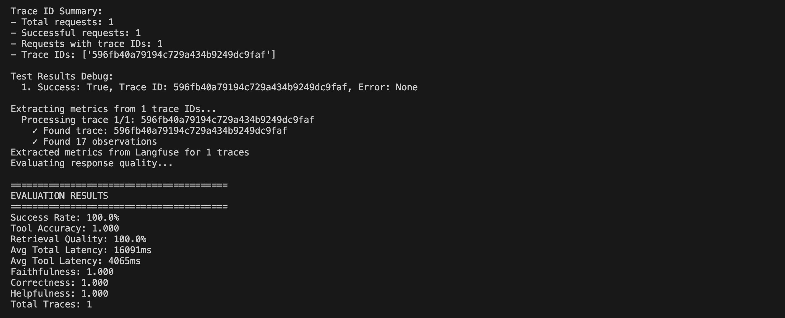

# Agentic AI Foundation - Generative AI Customer Experience Platform

## Introduction

The CX Agent is an intelligent customer experience platform built on **LangGraph** and designed for deployment on **AWS Bedrock AgentCore Runtime**. This agentic AI solution leverages multiple generative AI foundations including LLM Gateway, observability and guardrails to deliver sophisticated customer service capabilities through a conversational interface.


## High Level Architecture

For many of these AI platform capabilities, there are multiple alternative technologies that could be used. The right choices will depend on your needs, and there are also different ways to handle these choices: From committing to a particular preferred tool, to building (and maintaining) an abstraction layer for easy portability, or finding a balance somewhere in the middle.

In this sample we've tried to choose tools that are popular with our customers, and keep the code simple (avoid introducing extra abstraction layers) - so switching where needed would require some effort but should be reasonably straightforward. The overall architecture is as shown below:


**A Sample end-2-end User Interaction Flow**



## Generative AI Foundations

Strong foundational or "platform" capabilities increase the speed and success rate of generative and agentic AI projects. This sample demonstrates a customer service agent integrating several of these capabilities together:

1. **Centralized AI model gateway** to enable cross-project governance like cost tracking, fair usage limits, model access control and discovery.
2. **Guardrails** to detect and prevent risks in real-time like prompt injection attempts, toxic or offensive content, denied topics or hallucinations.
3. **Observability tools** for detailed monitoring of the deployed agent, analysis, and debugging via reasoning "traces".

### Multi-provider Generative AI Gateway
Centralized model management and routing system that provides:
- **Multi-model Support**: Access to numerous large language models (LLMs) through a unified, industry-standard API gateway based on OpenAI API standards
- **Load Balancing**: Intelligent request distribution across model endpoints based on uase, cost and latency
- **Usage and cost** tracking across providers
- **Rate Limiting**: Set model, key, team, user-level budgets for added governance

Refer to the prerequisites section to deploy your Generative AI Gateway on AWS.


### Observability
We combine [Amazon Bedrock AgentCore Observability](https://docs.aws.amazon.com/bedrock-agentcore/latest/devguide/observability-configure.html) together with [Langfuse](https://langfuse.com/) (Open Source Edition deployed on AWS as shown [here](https://github.com/aws-samples/amazon-bedrock-samples/tree/main/evaluation-observe)), to collect and analyze detailed telemetry from the agent as it runs. This integration provides:
- **OpenTelemetry instrumentation**
- **[Langfuse](https://langfuse.com/docs) Integration**: Complete conversation and agent execution tracing including all LLM and non-LLM calls such as retrieval, API calls and more
- **Performance Metrics**: Response times, token usage, and success rates
- **Debug Insights**: Detailed agent reasoning and tool usage tracking
- **User Feedback**: Track user feedback on using your generative AI application

Refer to the prerequisites section to self-host your Langfuse platform.


### Guardrails
We use [Amazon Bedrock Guardrails](https://docs.aws.amazon.com/bedrock/latest/userguide/guardrails.html) to detect and intervene on issues with incoming user messages and outgoing agent responses before they're processed - including:
- **Input Validation**: Content filtering and prompt injection protection
- **Output Screening**: Response safety and appropriateness checks including PII detection
- **Denied Categories**: Industry-specific regulatory adherence by denial of prohibited topics

Configure your own Bedrock guardrail and apply it to your agentic application with this [workshop](https://catalog.workshops.aws/bedrockguard/en-US)


## Prerequisites

Explore the README.md file under the **infra** directory for more details on the deployment.


## Usage

### Test locally

1. **Initialize the project and dependencies**:
```bash
cd cx-agent-backend
uv venv
uv sync --all-extras --frozen
```
2. **Run locally**: 
```bash
uv run python -m cx_agent_backend
```
3. **Test the health endpoint**:
```bash
curl http://localhost:8080/ping
```
4. **Test the agent endpoints**:
```bash
curl -X POST http://localhost:8080/api/v1/ \
  -H 'accept: application/json' \
  -H 'Content-Type: application/json' \
  -d '{"user_id": "<user_id>"}'

curl -X POST http://localhost:8080/invocations \
  -H "Content-Type: application/json" \
  -d '{"input": {"prompt": "Hello", "conversation_id": "<conversation_id>"}}' 

curl -X POST http://localhost:8080/api/v1/invocations \
  -H "Content-Type: application/json" \
  -d '{
    "feedback": {
      "run_id": "<run-id>",
      "session_id": "<session-id>", 
      "score": 1.0,
      "comment": "Great response!"
    }
  }'


```
5. **Run the Streamlit app**:
```bash
cd cx-agent-frontend
uv venv
uv sync --frozen
uv run streamlit run src/app.py --server.port 8501 --server.address 127.0.0.1
```
6. Access the web interface at `http://localhost:8501`

### Bedrock AgentCore Deployment

Refer to the **agentcore_runtime_deployment.ipynb** notebook to deploy your agent using [Bedrock AgentCore Runtime](https://docs.aws.amazon.com/bedrock-agentcore/latest/devguide/agents-tools-runtime.html).

## Evaluation

The platform includes comprehensive evaluation capabilities to assess agent performance across multiple dimensions.



### How Evaluation Works

The evaluation system runs test queries against your agent, collects execution traces, and measures performance:

1. **Load test queries** from `groundtruth.json` with expected tool usage
2. **Send queries to agent** endpoint and capture responses with trace IDs
3. **Wait for traces** to be available in Langfuse observability platform
4. **Extract metrics** from traces including tool calls, retrieval scores, and latencies
5. **Evaluate response quality** using Bedrock LLM to score faithfulness, correctness, and helpfulness
6. **Calculate performance metrics** and save comprehensive results to CSV files

### Evaluation Setup

The evaluation system consists of:
- **offline_evaluation.py**: Main evaluation script that runs test queries and calculates metrics
- **response_quality_evaluator.py**: Uses Bedrock LLM to evaluate response quality
- **groundtruth.json**: Test queries with expected tool usage (create this file with your test cases)

### Prerequisites

1. **Environment Variables**: Export Langfuse and AWS credentials:
   ```bash
   export LANGFUSE_SECRET_KEY="your-key"
   export LANGFUSE_PUBLIC_KEY="your-key"
   export LANGFUSE_HOST="your-langfuse-host"
   export AWS_ACCESS_KEY_ID="your-key"
   export AWS_SECRET_ACCESS_KEY="your-key"
   ```
2. **Agent Endpoint**: Have your agent running locally (`http://localhost:8080`) or deployed on Bedrock AgentCore
3. **Test Data**: Create `groundtruth.json` with test queries:

```json
[
  {
    "query": "How do I reset my router hub?",
    "expected_tools": ["retrieve_context"]
  }
]
```

### Running Evaluation

```bash
# Run offline evaluation
python offline_evaluation.py

# Or evaluate existing trace data
python response_quality_evaluator.py
```

### Metrics Collected

- **Success Rate**: Percentage of successful agent responses
- **Tool Accuracy**: How well the agent selects expected tools
- **Retrieval Quality**: Relevance scores from knowledge base retrieval
- **Response Quality**: AI-evaluated metrics using Bedrock LLM:
  - **Faithfulness** (0.0-1.0): How well the response sticks to provided context without hallucination
  - **Correctness** (0.0-1.0): How factually accurate and technically correct the response is
  - **Helpfulness** (0.0-1.0): How useful and relevant the response is to answering the user's query
- **Latency Metrics**: Total and per-tool response times

### Output Files

- **comprehensive_results.csv**: Complete evaluation results with all metrics
- **trace_metrics.csv**: Raw trace data from Langfuse
- **response_quality_scores.csv**: Detailed response quality evaluations

### Configuration

Set agent endpoint (local or AgentCore):
```bash
# For local agent
export AGENT_ARN="http://localhost:8080"

# For Bedrock AgentCore deployment
export AGENT_ARN="your-agentcore-endpoint"
```


## Security

See [CONTRIBUTING](CONTRIBUTING.md#security-issue-notifications) for more information.


## License

This library is licensed under the MIT-0 License. See the LICENSE file.
